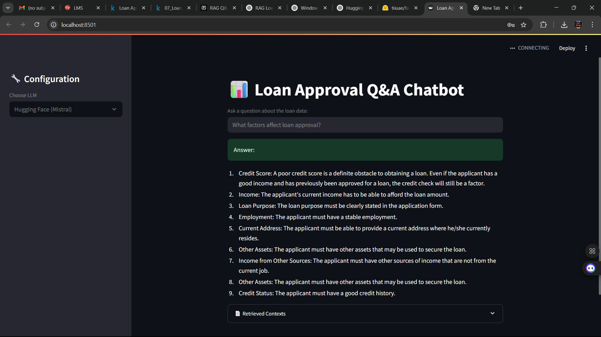

# 🤖 RAG Q&A Chatbot – Loan Approval Prediction 📊



A Retrieval-Augmented Generation (RAG) based Q&A chatbot that answers user queries using a loan approval prediction dataset. Built as part of the **Celebal Technologies Summer Internship 2025**, this project combines document retrieval (FAISS) and large language models (OpenAI or Hugging Face) to generate intelligent, context-aware responses.

---

## 🚀 Features

- 🔍 **Semantic search** over a CSV dataset using `sentence-transformers` and `FAISS`
- 🧠 **Natural Language Answers** using OpenAI GPT-3.5 or Hugging Face (Falcon/Mistral)
- 🌐 **Interactive Chatbot UI** built with Streamlit
- ⚙️ **LLM Choice** via sidebar: OpenAI or Hugging Face
- 🔐 Secure API key input through Streamlit sidebar

---

## 📁 Project Structure

```
rag_chatbot_streamlit/
├── app.py                  # Main Streamlit app
├── retriever.py            # Handles CSV preprocessing and FAISS retrieval
├── generator.py            # LLM-based answer generation logic
├── data/
│   └── Training Dataset.csv  # Source dataset (Kaggle)
├── ui.png                  # Screenshot of chatbot UI
├── requirements.txt        # All Python dependencies
└── README.md               # Project documentation
```

---

## 📊 Dataset

**Source**: [Kaggle - Loan Approval Prediction](https://www.kaggle.com/datasets/sonalisingh1411/loan-approval-prediction)  
**File Used**: `Training Dataset.csv`

Each row represents a loan applicant, with attributes such as:
- Gender, Marital Status, Education, Self-Employed
- ApplicantIncome, CoapplicantIncome, LoanAmount
- Credit History, Loan Status (Y/N)

---

## 💡 Sample Queries

You can ask the chatbot questions like:
- *What factors affect loan approval?*
- *Are self-employed applicants less likely to get approved?*
- *Compare approved vs rejected applicants by loan amount.*
- *Give examples of male applicants who got loan approval.*
- *What is the status of female applicants with high income?*

---

## 🛠️ Installation & Usage

### ✅ 1. Clone the Repository

```bash
git clone https://github.com/yashhackz360/Celebal-Technologies-Summer-Internship_2025.git
cd Celebal-Technologies-Summer-Internship_2025
```

### 📦 2. Install Requirements

```bash
pip install -r requirements.txt
```

### ▶️ 3. Run the Streamlit App

```bash
streamlit run app.py
```

---

## 🔧 Configuration

In the sidebar:
- Choose your **LLM provider**: `OpenAI` or `Hugging Face`
- For OpenAI, provide your **API key** securely

---

## 🧠 Technologies Used

- [Streamlit](https://streamlit.io/) – UI for Q&A interface
- [FAISS](https://github.com/facebookresearch/faiss) – Vector store for document retrieval
- [Sentence-Transformers](https://www.sbert.net/) – Embedding model (`all-MiniLM-L6-v2`)
- [OpenAI GPT-3.5](https://platform.openai.com/docs/) – Natural language generation
- [Hugging Face Transformers](https://huggingface.co/models) – Optional open-source LLMs (e.g., Falcon)

---

## 🧪 Future Improvements

- 🤝 Integrate LangChain for better RAG pipeline abstraction
- 📈 Add visualization of answer confidence or source context
- 🌍 Deploy on Streamlit Cloud or Hugging Face Spaces
- 🗂️ Extend support for more datasets (e.g., insurance, finance)

---

